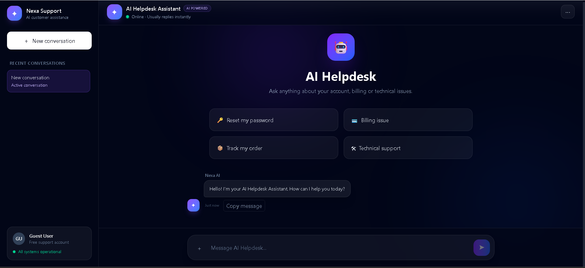
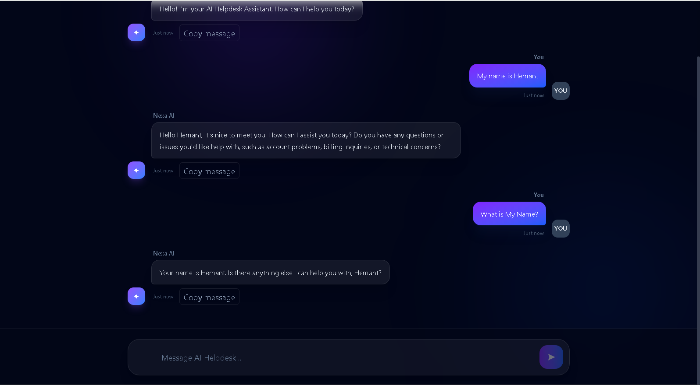

# 🚀 Nexa AI Helpdesk

An AI-powered customer support application built with **React**, **Express**, **LangGraph.js**, and **Groq**. The application supports persistent conversation memory, multiple chat sessions, markdown rendering, and a modern responsive UI.

## 🌐 Live Demo

### Frontend
https://nexa-ai-helpdesk.vercel.app

### Backend
https://nexa-ai-helpdesk.onrender.com

---

# ✨ Features

- 🤖 AI-powered customer support assistant
- 🧠 Persistent conversation memory using LangGraph MemorySaver
- 💬 Multiple conversations
- 📝 Markdown support
- 💻 Syntax highlighted code blocks
- 📋 Copy AI responses
- 🗑 Delete conversations
- 💾 LocalStorage persistence
- 📱 Responsive modern UI
- ⚡ Fast responses using Groq LLM

---

# 🛠 Tech Stack

## Frontend

- React
- Vite
- Tailwind CSS
- React Markdown
- Remark GFM
- React Syntax Highlighter

## Backend

- Node.js
- Express.js
- LangGraph.js
- LangChain
- Groq API

---

# 📂 Project Structure

```text
nexa-ai-helpdesk/
│
├── backend/
│   ├── graph.js
│   ├── server.js
│   ├── package.json
│   └── ...
│
├── frontend/
│   ├── src/
│   ├── public/
│   ├── package.json
│   └── ...
│
└── README.md
```

---

# ⚙️ Installation

## Clone Repository

```bash
git clone https://github.com/hemant-312011/nexa-ai-helpdesk.git
```

Go inside project

```bash
cd nexa-ai-helpdesk
```

---

# Backend Setup

```bash
cd backend
npm install
```

Create a `.env` file

```env
GROQ_API_KEY=your_groq_api_key
FRONTEND_URL=http://localhost:5173
```

Start backend

```bash
npm start
```

---

# Frontend Setup

```bash
cd frontend
npm install
npm run dev
```

---

# 🚀 Deployment

## Frontend

- Vercel

## Backend

- Render

---

# 📸 Screenshots


### AI Helpdesk Chat Interface



### AI Conversation Memory



---

# Future Improvements

- User Authentication
- Database Integration
- File Upload Support
- Streaming Responses
- Voice Chat
- Dark / Light Theme Toggle

---

# 👨‍💻 Author

**Hemant Rao**

GitHub

https://github.com/hemant-312011

---

# ⭐ Support

If you like this project, don't forget to ⭐ star the repository.